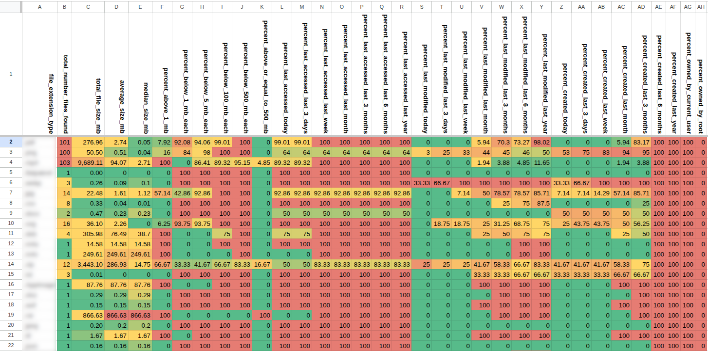
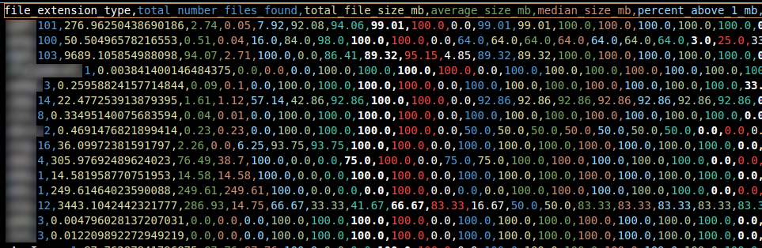
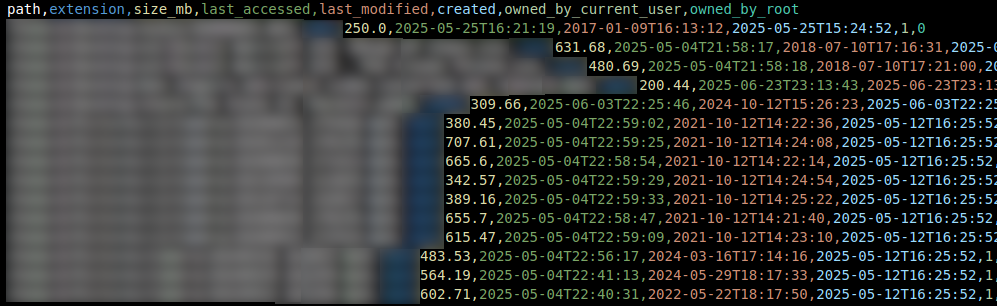

# Files Stats Analysis Tool

A Python-based file system analysis toolkit that scans directories and generates detailed statistical reports about file usage patterns, sizes, and metadata. Useful for advanced disk space analysis, file organization, and identifying stale or large files.

**You are most welcome to use this code in your commercial projects, all that I ask in return is that you credit my work by providing a link back to this repository. Thank you & Enjoy!**



## Features

- **Comprehensive File Analysis**: Scan directories and analyze files by extension, size, timestamps, and ownership
- **Statistical Reporting**: Generate detailed CSV reports with 34+ metrics per file extension
- **Flexible Filtering**: Find files matching specific criteria (size, age, ownership, extension)
- **Progress Tracking**: Visual progress bars for long-running directory scans
- **CSV Export**: Ready-to-import data for spreadsheet analysis and visualization

## Quick Start

### 1. Setup Environment

```bash
# Clone or download the project
cd files_stats

# Install dependencies
pip install -r requirements.txt

# Configure scan path
cp env_sample .env
# Edit .env and set: SCAN_PATH=/path/to/analyze
```

### 2. Generate File Statistics

```bash
# Scan directory and create summary.csv with statistics by file extension
python create_file_summary.py
```

This creates `summary.csv` with metrics like:
- File counts and total sizes by extension
- Size distribution percentiles
- Access/modification/creation time patterns
- Ownership statistics

### 3. Filter Specific Files

```bash
# Configure filter criteria
cp filter_conditions_sample.json filter_conditions.json
# Edit filter_conditions.json with your criteria

# Run filter to find matching files
python filter_files.py
```

Example: Find large files (>200MB) not accessed in 60+ days:
```json
{
  "out": "stale_large_files.csv",
  "min_size_mb": 200,
  "not_accessed_within": 60,
  "logic": "all"
}
```

## Configuration

### Environment Variables (.env)
```bash
SCAN_PATH=/home/username/Documents  # Required: Directory to analyze
```

### Filter Conditions (filter_conditions.json)
```json
{
  "out": "filtered_files.csv",           // Output filename
  "ext": [".mp4", ".mkv"],               // File extensions (optional)
  "min_size_mb": 100,                    // Minimum file size in MB
  "max_size_mb": 1000,                   // Maximum file size in MB
  "accessed_within": 30,                 // Files accessed within N days
  "not_accessed_within": 90,             // Files NOT accessed within N days
  "modified_within": 7,                  // Files modified within N days
  "not_modified_within": 180,            // Files NOT modified within N days
  "owned_by": "current",                 // "current", "root", or null
  "logic": "all"                         // "all" (AND) or "any" (OR)
}
```

## Output Examples

### Summary Report (summary.csv)


Statistics include:
- Total files and size by extension
- Size percentiles (median, >1MB, >100MB, etc.)
- Temporal analysis (accessed/modified in last day/week/month/year)
- Ownership breakdown

### Filtered Files (stale_large_files.csv)


Individual file records with:
- Full file paths and extensions
- Exact sizes and timestamps
- Ownership information

### Import into a Spreadsheet (optional)

You can import CSV files into Google Sheets, Excel, or other analysis tools for further manual processing and visualization.


*Summary CSV imported into Google Sheets with conditional formatting applied to each column*

#### How to re-create the screenshot above

1. Upload your summary CSV output to Google Drive and open it in Google Sheets
2. Select all of row 1, then click `Format > Rotation > Rotate Down`
3. Click the top left corner of the sheet to select the entire sheet, then double click any column border to re-size the sheet so it fits in one window.
4. Select all of column B, then click `Format > Conditional Formatting > Add another rule > Color scale` then under `format rules` click `preview` and select the `green to yellow to red` gradient template. Click Done
5. Repeat the above step for each remaining column.

## Use Cases

### Disk Space Analysis
```bash
# Find your largest files by extension
python create_file_summary.py
# Sort summary.csv by 'total_file_size_mb' column
```

### Cleanup Large Stale Files
```json
{
  "min_size_mb": 500,
  "not_accessed_within": 180,
  "logic": "all"
}
```

### Find Old Downloads
```json
{
  "ext": [".zip", ".tar.gz", ".deb", ".dmg"],
  "not_modified_within": 365,
  "logic": "all"
}
```

### Media File Audit
```json
{
  "ext": [".mp4", ".mkv", ".avi", ".mov"],
  "min_size_mb": 1000,
  "logic": "all"
}
```
and many more...

## Advanced Usage

### Custom Exclusions
Edit global variables in scripts to exclude specific directories or extensions:

```python
# In create_file_summary.py or filter_files.py
exclude_dirs = {'node_modules', '.git', '__pycache__', 'venv'}
exclude_extensions = {'.tmp', '.log', '.cache'}
```

### Batch Processing
```bash
# Analyze multiple directories
for dir in /home/user1 /home/user2 /var/www; do
  SCAN_PATH=$dir python create_file_summary.py
  mv summary.csv summary_$(basename $dir).csv
done
```

### Performance Tips
- Start with smaller directories to test configurations
- Use `SCAN_PATH` with limited scope for initial runs
- Monitor memory usage on very large file systems
- Consider excluding high-traffic directories (logs, caches)

## Dependencies

- **Python 3.13+** (works with prior versions down to Python 3.6) 
- **tqdm**: Progress bars for long-running scans
- **python-dotenv**: Environment variable management


## Troubleshooting

### Permission Errors

The tool gracefully handles permission-denied files and directories. Check console output for any persistent access issues.

## Contributing

This tool is designed to be easily extensible:
- Add new filter criteria in `passes_conditions()` function
- Extend statistics in `get_summary_data()` calculations
- Modify CSV output formats as needed
